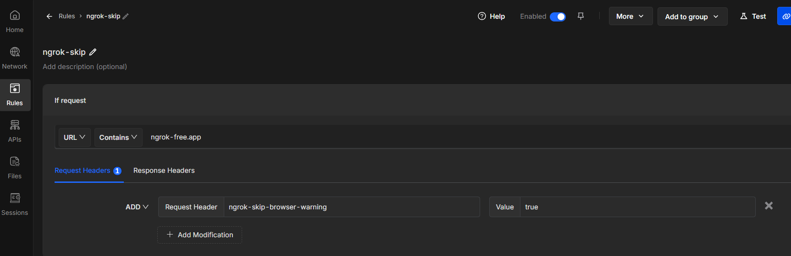

# SEALIFT


for any temporary testing at a web-exposed URL:
```
ngrok.exe http --host-header=rewrite http://localhost:443
```
ngrok will show a HTML page with a browser warning by default.
To circumvent this, can add `ngrok-skip-browser-warning` to a request header. Chrome extension Requestly is the more automated way to do this:


```
docker build -t sealift:latest .
docker tag sealift:latest czhang19/christina:sealift
docker push czhang19/christina:sealift
```

```
net start MongoDB
net stop MongoDB
sc query MongoDB
netstat -aon | findstr 27017
tasklist /FI "PID eq <pid_from_netstat_cmd>"
Test-NetConnection -ComputerName 127.0.0.1 -Port 27017     # for firewall check
```

mongo seems to default listen to IPv4:

```
TCP 127.0.0.1:27017 → IPv4 only
TCP [::1]:27017 → IPv6 only
TCP 0.0.0.0:27017 or [::]:27017 → All interfaces (IPv4 or IPv6)
```
netstat on where mongo is listening will show `127.0.0.1:27017` and not `[::1]:27017`.

instead of making mongo listen on IPv6 too by changing mongod.conf,
can use `127.0.0.1` and not `localhost` to avoid IPv6 resolution. 

by default, containers use a bridge network, 
and the host’s 127.0.0.1 isn’t directly accessible unless you configure it:
```
host.docker.internal    # resolves to host IP, for container isolation
docker run ... --network host   # share host network stack
ipconfig    # use LAN/Ethernet IPv4 instead of 127.0.0.1
```