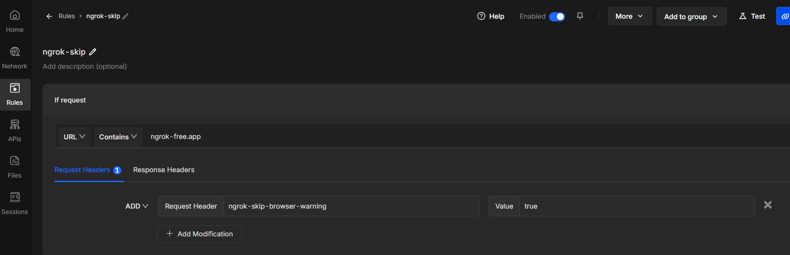
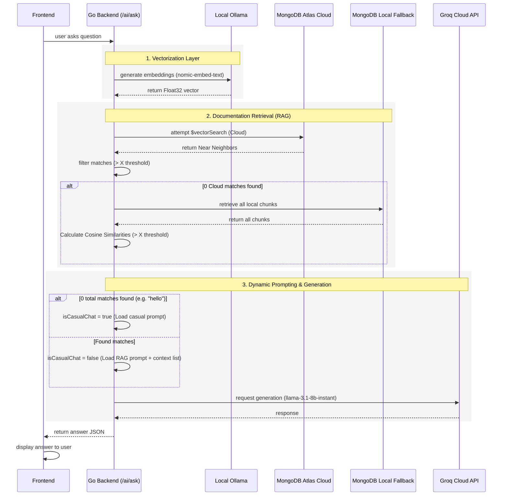

# SEALIFT


for any temporary testing at a web-exposed URL:
```
ngrok.exe http --host-header=rewrite http://localhost:443
```
ngrok will show a HTML page with a browser warning by default.
To circumvent this, can add `ngrok-skip-browser-warning` to a request header. Chrome extension [Requestly](https://requestly.com/) is the more automated way to do this:


```
docker build -t sealift:latest .
docker tag sealift:latest czhang19/christina:sealift
docker push czhang19/christina:sealift
```

```
net start MongoDB
net stop MongoDB
sc query MongoDB
netstat -aon | findstr 27017
tasklist /FI "PID eq <pid_from_netstat_cmd>"
Test-NetConnection -ComputerName 127.0.0.1 -Port 27017     # for firewall check
```

mongo seems to default listen to IPv4:

```
TCP 127.0.0.1:27017 → IPv4 only
TCP [::1]:27017 → IPv6 only
TCP 0.0.0.0:27017 or [::]:27017 → All interfaces (IPv4 or IPv6)
```
netstat on where mongo is listening will show `127.0.0.1:27017` and not `[::1]:27017`.

instead of making mongo listen on IPv6 too by changing mongod.conf,
can use `127.0.0.1` and not `localhost` to avoid IPv6 resolution. 

by default, containers use a bridge network, 
and the host’s 127.0.0.1 isn’t directly accessible unless you configure it:
```
host.docker.internal    # resolves to host IP, for container isolation
docker run ... --network host   # share host network stack
ipconfig    # use LAN/Ethernet IPv4 instead of 127.0.0.1
```

if you get:
```
ERROR failed to create destination (non-fatal) err="notification API returned status 409: {\"errors\":[{\"errorId\":195020,\"domain\":\"API_NOTIFICATION\",\"category\":\"REQUEST\",\"message\":\"Challenge verification failed for requested endpoint.\"}]}"
```

just remember to set `ENDPOINT_URL`.

## notification endpoints

```
curl -X GET "http://localhost:443/api/notification/destinations" --cookie "authjs.session-token=<token>" | jq .
```
get <token> from `authjs.session-token` (for dev) Cookie in DevTools

```
curl -X DELETE "http://localhost:443/api/notification/destinations/allusers" --cookie "authjs.session-token=<token>" | jq .
```

## ai
when asking a question at `/ai/ask`, sealift attempts Atlas Vector Search first.

if Atlas is down or slow, it instantly falls back to searching the local DB,
which uses local manual search to fetch *every* documentation chunk first,
and then run cosine similarity again to find the most relevant chunk.

```
[System.Environment]::SetEnvironmentVariable('OLLAMA_HOST', '0.0.0.0', 'User')
```
**ingestion**: `/ai/ingest` saves docs under `/docs` to both Cloud Atlas and the local DB.

```
curl -X POST http://localhost:443/api/ai/ingest
```

to spare local CPU/RAM from heavy workloads, 
sealift uses both *local*, computationally-inexpensive components (embeddings and fallback storage) and *cloud infra* (vector DBs and heavy generative AI models). 

## request flow diagram

```mermaid
sequenceDiagram
    participant Frontend as Frontend
    participant Backend as Go Backend (/ai/ask)
    participant Ollama as Local Ollama
    participant Atlas as MongoDB Atlas Cloud
    participant LocalDB as MongoDB Local Fallback
    participant Groq as Groq Cloud API

    Frontend->>Backend: user asks question
    
    rect rgba(128,128,128,0.08)
        Note over Backend,Ollama: 1. Vectorization Layer
        Backend->>Ollama: generate embeddings (nomic-embed-text)
        Ollama-->>Backend: return Float32 vector
    end

    rect rgba(128,128,128,0.08)
        Note over Backend,LocalDB: 2. Documentation Retrieval (RAG)
        Backend->>Atlas: attempt $vectorSearch (Cloud)
        Atlas-->>Backend: return Near Neighbors
        Backend->>Backend: filter matches (> X threshold)
        
        alt 0 Cloud matches found
            Backend->>LocalDB: retrieve all local chunks
            LocalDB-->>Backend: return all chunks
            Backend->>Backend: Calculate Cosine Similarities (> X threshold)
        end
    end

    rect rgba(128,128,128,0.08)
        Note over Backend,Groq: 3. Dynamic Prompting & Generation
        
        alt 0 total matches found (e.g. "hello")
            Backend->>Backend: isCasualChat = true (Load casual prompt)
        else Found matches
            Backend->>Backend: isCasualChat = false (Load RAG prompt + context list)
        end

        Backend->>Groq: request generation (llama-3.1-8b-instant)
        Groq-->>Backend: response
    end

    Backend-->>Frontend: return answer JSON
    Frontend->>Frontend: display answer to user
```

**1. Vectorization (local)**
* **model:** `nomic-embed-text` (tiny (~200MB) and inherently stateless)

when a query is submitted, the Go backend asks local Ollama daemon to turn the text strings into a mathematical vector list.

**2. Storage & Fallback Retrieval (Cloud + local)**
* **primary DB:** MongoDB Atlas (`$vectorSearch`)
* **fallback DB:** Local MongoDB

the Go backend compares the mathematical distance between the query vector and the documentation chunk vectors. to prevent hallucination, it filters out any chunks that have a similarity score less than the `AI_SIMILARITY_THRESHOLD` (e.g. 0.30), both locally and on Atlas. 

**3. Decision & Generation (Cloud)**
* **model:** `llama-3.1-8b-instant` (via Groq API)

if no results meet the similarity threshold (i.e. "hello"), the backend flags the conversation as `isCasualChat` so the model isn't confused by a lack of context. the backend bundles the strict context + prompt constraints and sends the payload as an OpenAI-compatible JSON to Groq's APIs.
